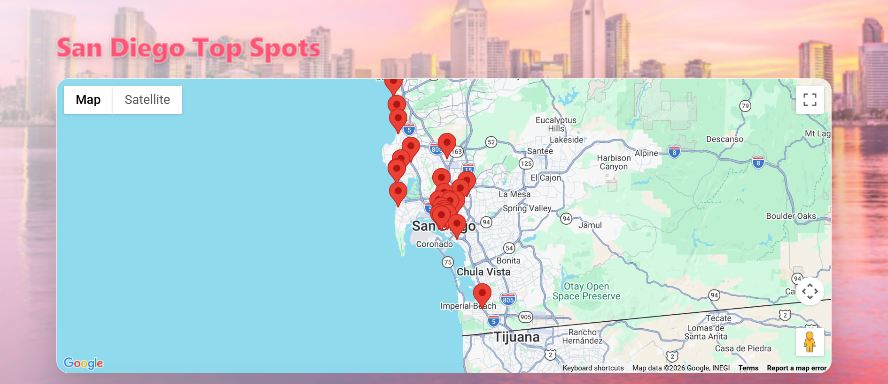
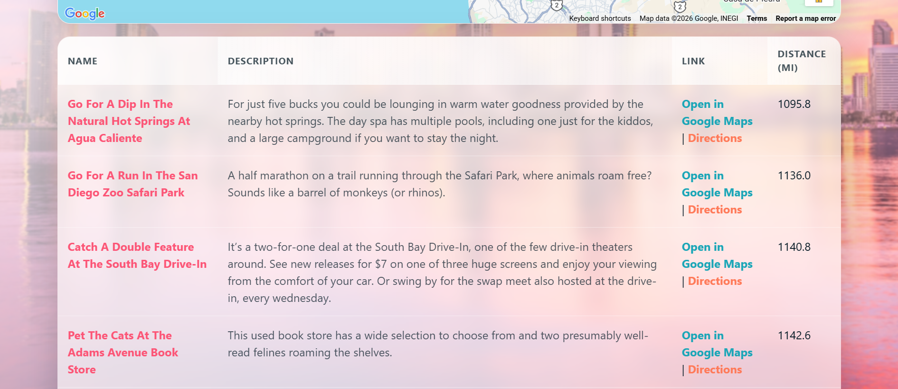
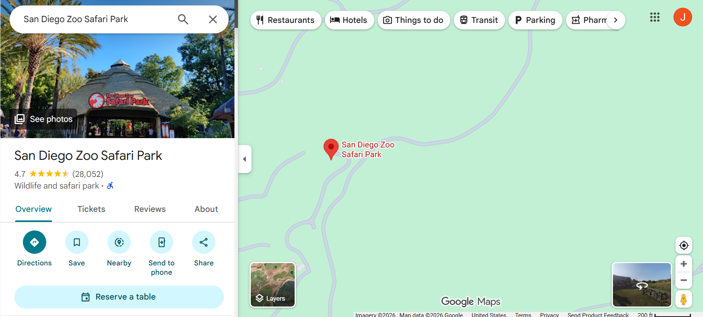
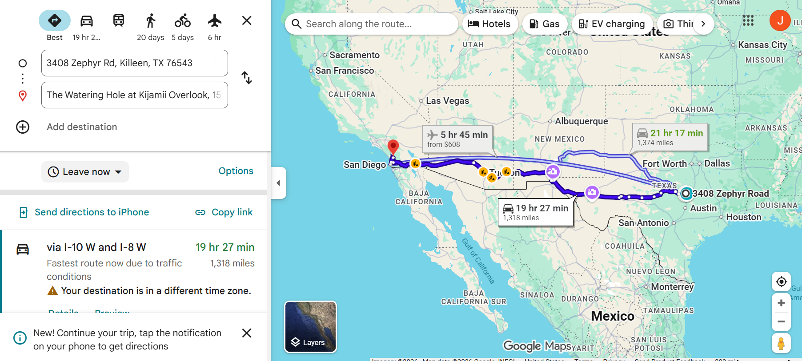

# San Diego Top Spots

A structured, map-driven web application that displays curated locations across San Diego using the Google Maps JavaScript API.

This project demonstrates intentional frontend architecture, API integration, distance computation using the Haversine formula, dynamic DOM rendering, and secure API deployment practices.

---

## Live Demo

View the live project here:  
https://awaddell-dev.github.io/San-Diego-Top-Spots/

---

## Features

* Interactive Google Map with dynamically generated markers
* Marker hover tooltips displaying location details
* Real-time distance calculation from user location
* Automatic sorting by proximity
* Direct Google Maps and Directions links
* Graceful fallback when geolocation is unavailable
* Responsive layout for desktop and mobile
* Referrer-restricted Google Maps API key

---

## Tech Stack

* HTML5 – application structure and layout
* CSS3 – responsive design and themed UI
* JavaScript (ES6) – application logic and computation
* jQuery – asynchronous data loading and DOM manipulation
* Google Maps JavaScript API – map rendering and markers
* Git – version control
* GitHub Pages – deployment

---

## Architecture Overview

The application is intentionally organized into clearly defined layers:

* **Bootstrap / Entry Point** – Initializes the application when the DOM is ready
* **Controller Layer** – Coordinates data loading, geolocation, sorting, and UI updates
* **Domain Logic** – Encapsulates Haversine distance calculation and sorting rules
* **View Layer** – Dynamically constructs and renders table rows
* **Google Maps Integration** – Manages map initialization, marker lifecycle, and info windows
* **Utility Layer** – Centralized URL builders and reusable helpers
* **Geolocation Module** – Promise-based abstraction around the browser navigator API

This separation keeps business logic, UI rendering, and map behavior isolated and maintainable.

---

## UI & Styling Approach

* CSS custom properties (design tokens) for maintainability
* Sunset-inspired color palette aligned with the San Diego theme
* Layered background with blur overlay for readability
* Glass-style card surfaces with controlled shadow depth
* Dedicated link classes to establish clear action hierarchy

The visual design intentionally balances polish with usability and performance.

---

## Screenshots

### Map with Dynamic Markers



---

### Sorted Table with Distance Calculation



---

### Google Maps Place Result



---

### Driving Directions Example



---

## Security Considerations

* API key restricted by HTTP referrer (GitHub Pages domain only)
* API access restricted to the Maps JavaScript API
* Loaded using the official Google callback initialization pattern

These controls prevent unauthorized usage outside the deployed application.

---

## Installation & Usage

1. Clone the repository:

```bash
git clone git@github.com:awaddell-dev/San-Diego-Top-Spots.git
```

2. Navigate into the project folder:

```bash
cd San-Diego-Top-Spots
```

3. Open `index.html` using a local server (e.g., Live Server).

---

## Engineering Concepts Demonstrated

* Asynchronous data loading  
* Promise-based geolocation handling  
* Mathematical distance computation (Haversine formula)  
* Dynamic DOM construction  
* Marker lifecycle management  
* Referrer-restricted API security  
* Intentional frontend architectural layering  

---

## Author

Alex Waddell  
GitHub: https://github.com/awaddell-dev